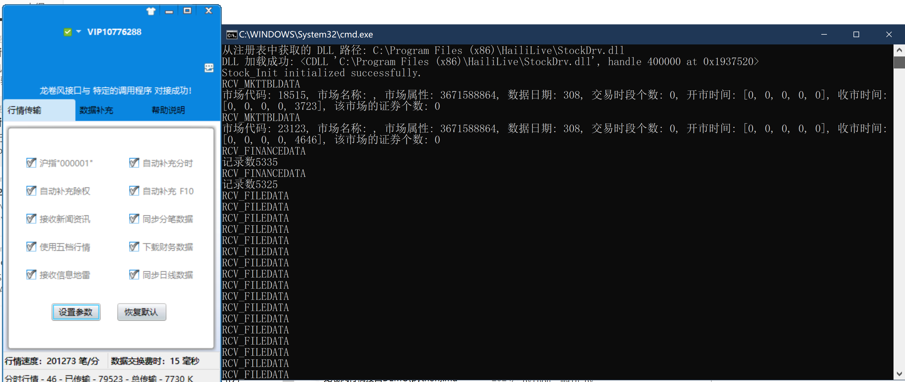

# 龙卷风行情接口DEMO(python)

该项目的核心思路就是创造一个带有句柄的窗口，通过加载dll文件，使用dll中约定的函数跟dll发送请求与接受数据，通过判断数据的类型与内容进行不同数据的保存。需要注意的是python要下载32位

```sh
# 文件目录说明
├── data
|    └──... # 保存所有接收到的数据
├── logs
|    └──... # 日志文件夹
├── images
|    └──... # 存储本文件的图片
├── constant.py # 定义结构以及常量文件
├── convert_func.py # 文件格式转换代码，支持csv2raw和raw2csv
├── del_data.py # 用于递归删除data文件夹数据文件
├── dll_loader.py # 加载dll，定义窗口
├── extended_api.py # 定义主动向龙卷风发请求函数
├── generate_func.py # 存储数据生成函数文件，用于将龙卷风发来的数据转换成csv中的数据以及raw数据
├── install.txt # 安装须知
├── main.py # 项目入口
├── requests.py # 主动向dll发送请求，需要调用extended_api函数
├── run_main.bat # 运行窗口脚本，在windows上以管理员身份运行main.py
├── run_test.bat # 运行测试请求数据脚本，在windows上以管理员身份运行requests.py
├── test.py # 测试文件，用于不同需求的测试
├── utils.py # 包含工具函数
```

下面以运行流程的视角梳理项目：

## 1、项目运行

以管理员身份运行run_main.bat文件，在正常情况下会弹出控制台以及自动打开龙卷风高速股票引擎，并在data文件夹下保存数据



## 2、dll加载与窗口的创建

当运行run_main.bat文件时，会自动以管理员的身份运行main.py文件，该文件调用run_message_loop()函数开启消息接收循环。在run_message_loop()函数中首先创建win32Gui窗口，获得窗口的句柄。因为需要将窗口句柄传给dll，以便能进行dll数据的发送与窗口的接收相绑定。接着初始化dll，dll函数初始化流程如下：程序查询用户注册表，找到HKEY_LOCAL_MACHINE下的SOFTWARE\\WOW6432Node\\stockdrv项。获取该项中Driver键对应的值，该值为dll所在路径。使用ctypes.CDLL加载路径即加载成功，得到dll。接着调用dll中的Stock_Init函数传入句柄、消息以及工作方式，后两个参数与C++Demo保持一致。在进行Stock_Init后，dll文件会打开龙卷风文件并持续通过窗口句柄向窗口发送信息，具体见下：

## 3、窗口接收数据详解

在创建win32Gui窗口时，使用wc.lpfnWndProc = wnd_proc来绑定窗口的处理函数，这个函数是自定义的，对dll发送的数据进行解析与保存，是整个项目的核心。

def wnd_proc(*hwnd*, *msg*, *wparam*, *lparam*):函数的参数分别为：窗口的句柄、接收到的信息、接收到的数据类型（通过这个判断数据属于报告数据还是分时数据等）、传递的消息指针（数据通过访问指针获得）。首先会判断msg与Stock_Init传入的消息是否一致，来判断目前句柄得到的信息是不是dll传递的。然后将消息指针lparam转换成定义好的结构体RCV_DATA指针，来进行数据的读取。RCV_DATA结构如下(结构和常量在constant.py中定义)：

```python
# 定义联合体  关于data_union中的各种数据结构在下面分类型分析的时候再做解释
class RCV_DATA_UNION(ctypes.Union):
    _fields_ = [
        ("m_pReportV3", ctypes.POINTER(RCV_REPORT_STRUCTExV3)), # 对应报告数据
        ("m_pDay", ctypes.POINTER(RCV_HISTORY_STRUCTEx)), # 补充日线数据
        ("m_pMinute", ctypes.POINTER(RCV_MINUTE_STRUCTEx)), # 补充分时线数据
        ("m_pPower", ctypes.POINTER(RCV_POWER_STRUCTEx)), # 补充除权数据
        ("m_p5Min", ctypes.POINTER(RCV_HISMINUTE_STRUCTEx)), # 补充历史五分钟K线数据,每一数据结构都应通过 m_time == EKE_HEAD_TAG,判断是否为 m_head,然后再作解释
        ("m_pData", ctypes.c_void_p),  # 使用 void* 表示通用指针
    ]

# 定义 RCV_DATA 结构体
class RCV_DATA(ctypes.Structure):
    _fields_ = [
        ("m_wDataType", ctypes.c_int),        # 文件类型
        ("m_nPacketNum", ctypes.c_int),       # 记录数 表示行情数据和补充数据(包括 Header)的数据包数
        ("m_File", RCV_FILE_HEADEx),          # 文件接口
        ("m_bDISK", ctypes.c_bool),           # 文件是否已存盘
        ("data_union", RCV_DATA_UNION),       # 联合体
    ]
```

所有的数据都预先由RCV_DATA结构体接收，然后通过判断wparam来判断消息的类型从而进行不同消息的提取。下面按接收消息类型的顺序说明。

## 4、RCV_MKTTBLDATA类型数据

wparam首先传递的消息类型为RCV_MKTTBLDATA类型，该类型消息的接收需要将消息指针lparam转换为HLMarketType类型指针，具体定义可以参考constant.py文件。在得到消息后会获取当前时间并进行日志的打印，接着会创建data/RCV_MKTTBLDATA\*.csv文件，\*号表示当前时间。当得到转换后的HLMarketType指针后，保存到csv文件中。同时需要得到HLMarketType中的m_nCount，表示对应市场的证券个数。使用循环访问每一个证券，结构体为RCV_TABLE_STRUCT，保存到data/RCV_TABLE_STRUCT\*.csv文件中。

```python
# 市场信息
class HLMarketType(ctypes.Structure):
    _pack_ = 1  # 设置结构体对齐
    _fields_ = [
        ("m_wMarket", ctypes.c_ushort),                 # 市场代码 2
        ("m_Name", ctypes.c_char * MKTNAME_LEN),       # 市场名称 16
        ("m_lProperty", ctypes.c_ulong),                # 市场属性 4
        ("m_lDate", ctypes.c_ulong),                    # 数据日期 4
        ("m_PeriodCount", ctypes.c_ushort),            # 交易时段个数 2
        ("m_OpenTime", ctypes.c_ushort * 5),           # 开市时间 10
        ("m_CloseTime", ctypes.c_ushort * 5),          # 收市时间 10
        ("m_nCount", ctypes.c_ushort),                  # 该市场的证券个数 得到此个数后可以跟指向证券的指针结合循环地址偏移来读取证券数据
        ("m_Data", ctypes.POINTER(RCV_TABLE_STRUCT)),   # 指向证券数据的指针
    ]	
```

```python
# 证券数据
class RCV_TABLE_STRUCT(ctypes.Structure):
    _pack_ = 1  # 设置结构体对齐
    _fields_ = [
        ("m_szLabel", ctypes.c_char * STKLABEL_LEN),  # 股票代码,以'\0'结尾,如 "500500"
        ("m_szName", ctypes.c_char * STKNAME_LEN),    # 股票名称,以'\0'结尾,"上证指数"
        ("m_cProperty", ctypes.c_ushort),               # 每手股数
    ]
```

**值得注意的是！！！！**：对于python中对应结构体的设置一定一定要设置内存对齐，否则将无法正常访问数据。关键词：\__pack\_\_=1表示内存紧凑排列。其次，针对使用字符数组接收的数据，如股票名称等ctypes.c_ushort * 5，由于在C++语言中使用字符数据接收，所以为了保持对应，在python中也使用字符数组接收，虽然保证了接收的完整性，但是降低了可读性。因此，在输出到文件中时，对于股票代码的字符数组表示，需要使用ascii码转化为字符串。对于股票名称的字符数组表示，需要使用gbk转化为字符串

```python
# 市场信息示例：RCV_MKTTBLDATA_2024-11-13 20-44-47.388.csv
市场代码,市场名称,市场属性,数据日期,交易时段个数,开市时间,收市时间,证券个数
18515,[],0,20241113,0,"[0, 0, 0, 0, 0]","[0, 0, 0, 0, 0]",3724
```

```python
# 证券数据示例：RCV_TABLE_STRUCT_2024-11-13 20-44-47.388.csv
股票代码,股票名称,每股手数
000001,上证指数,777
000002,Ａ股指数,777
000003,Ｂ股指数,777
```

## 5、RCV_FINANCEDATA类型数据

流程与接收到RCV_MKTTBLDATA信息流程相同，结构体如下：

```python
class Fin_LJF_STRUCTEx(ctypes.Structure):
    _pack_ = 1  # 设置结构体对齐
    _fields_ = [
        ("m_wMarket", ctypes.c_ushort),                 # 股票市场类型
        ("N1", ctypes.c_ushort),                        # 保留字段
        ("m_szLabel", ctypes.c_char * 10),             # 股票代码
        ("BGRQ", ctypes.c_long),                        # 财务数据的日期
        ("ZGB", ctypes.c_float),                        # 总股本
        ("GJG", ctypes.c_float),                        # 国家股
        ("FQFRG", ctypes.c_float),                      # 发起人法人股
        ("FRG", ctypes.c_float),                        # 法人股
        ("BGS", ctypes.c_float),                        # B股
        ("HGS", ctypes.c_float),                        # H股
        ("MQLT", ctypes.c_float),                       # 目前流通
        ("ZGG", ctypes.c_float),                        # 职工股
        ("A2ZPG", ctypes.c_float),                      # A2转配股
        ("ZZC", ctypes.c_float),                        # 总资产(千元)
        ("LDZC", ctypes.c_float),                       # 流动资产
        ("GDZC", ctypes.c_float),                       # 固定资产
        ("WXZC", ctypes.c_float),                       # 无形资产
        ("CQTZ", ctypes.c_float),                       # 长期投资
        ("LDFZ", ctypes.c_float),                       # 流动负债
        ("CQFZ", ctypes.c_float),                       # 长期负债
        ("ZBGJJ", ctypes.c_float),                      # 资本公积金
        ("MGGJJ", ctypes.c_float),                      # 每股公积金
        ("GDQY", ctypes.c_float),                       # 股东权益
        ("ZYSR", ctypes.c_float),                       # 主营收入
        ("ZYLR", ctypes.c_float),                       # 主营利润
        ("QTLR", ctypes.c_float),                       # 其他利润
        ("YYLR", ctypes.c_float),                       # 营业利润
        ("TZSY", ctypes.c_float),                       # 投资收益
        ("BTSR", ctypes.c_float),                       # 补贴收入
        ("YYWSZ", ctypes.c_float),                      # 营业外收支
        ("SNSYTZ", ctypes.c_float),                     # 上年损益调整
        ("LRZE", ctypes.c_float),                       # 利润总额
        ("SHLR", ctypes.c_float),                       # 税后利润
        ("JLR", ctypes.c_float),                        # 净利润
        ("WFPLR", ctypes.c_float),                      # 未分配利润
        ("MGWFP", ctypes.c_float),                      # 每股未分配
        ("MGSY", ctypes.c_float),                       # 每股收益
        ("MGJZC", ctypes.c_float),                      # 每股净资产
        ("TZMGJZC", ctypes.c_float),                    # 调整每股净资产
        ("GDQYB", ctypes.c_float),                      # 股东权益比
        ("JZCSYL", ctypes.c_float),                     # 净资收益率
    ]
```

需要注意的是BGRQ字段，是以1970到目前的秒数来表示，需要转化为UTC时间

## 6、RCV_FILEDATA类型数据

RCV_FILEDATA包含多种数据：日线数据、五分钟数据、分时数据、除权数据、基本资料、新闻类

数据类型的判断根据RCV_DATA结构体中的m_wDataType进行，得到对应的类型之后访问RCV_DATA中的data_union中的对应的数据进行指针的转换，然后访问数据。

根据数据类型接收的顺序来说明，首先会接收除权数据：

除权数据C++Demo并未进行操作，打印获取信息后跳出循环，接着接收分时数据。


分时数据存于RCV_DATA中的data_union中的m_pMinute中，m_pMinute是个包含数据的数组，其中元素对应结构体是RCV_MINUTE_STRUCTEx，首先需要进行结构体指针转换。数据个数在RCV_DATA的m_nPacketNum中。m_pMinute结构体格式如下：

```python
# 补充分时线数据
class RCV_MINUTE_STRUCTEx(ctypes.Union):
    # _pack_ = 1
    class InnerStruct(ctypes.Structure):
            _fields_ = [
            ("m_time", ctypes.c_long),                     # time_t 对应 32 位的有符号整数
            ("m_fPrice", ctypes.c_float),
            ("m_fVolume", ctypes.c_float),
            ("m_fAmount", ctypes.c_float)
        ]
    _fields_ = [
        ("m_head", RCV_EKE_HEADEx),                   # RCV_EKE_HEADEx 结构体
        ("m_inner_struct", InnerStruct)               # 内部结构体
    ]
    # 设置 _anonymous_ 以便可以直接访问内部结构体的字段
    _anonymous_ = ("m_inner_struct",)
class RCV_EKE_HEADEx(ctypes.Structure):
    _fields_ = [
        ("m_dwHeadTag", ctypes.c_ulong),  # DWORD 通常是无符号长整型
        ("m_wMarket", ctypes.c_ushort),    # WORD 通常是无符号短整型
        ("m_szLabel", ctypes.c_char * STKLABEL_LEN),  # 股票代码
    ]
```

RCV_MINUTE_STRUCTEx由两部分组成，为m_head和m_inner_struct组成，其中m_head包含股票代码信息，m_inner_struct包含分时数据。这样做的目的是m_head可以重复利用，在对应除权数据与五分钟数据等结构体中仍使用m_head进行股票代码信息判断。在循环m_pMinute的过程中，首先判断m_head.m_dwHeadTag，如果为EKE_HEAD_TAG，证明接下来输出该股票的信息，需要加载股票代码等相关信息。如果不为EKE_HEAD_TAG，说明在读取股票的分时数据。读取完之后进行数据的保存。

以完全相同的方法可以接收日线数据和补五分钟数据

对于基本资料，会将数据保存到./data/基本资料中

## 7、RCV_REPORT类型数据

RCV_REPORT数据对应RCV_REPORT_STRUCTExV3结构体，具体结构如下：

```python
# 定义 RCV_REPORT_STRUCTExV3 结构体
class RCV_REPORT_STRUCTExV3(ctypes.Structure):
    # 设置内存对齐
    _pack_ = 1
    _fields_ = [
        ("m_cbSize", ctypes.c_uint16),                # 结构大小 (WORD)
        ("m_time", ctypes.c_long),                    # 成交时间 (time_t)
        ("m_wMarket", ctypes.c_uint16),               # 股票市场类型 (WORD)
        ("m_szLabel", ctypes.c_char * STKLABEL_LEN), # 股票代码
        ("m_szName", ctypes.c_char * STKNAME_LEN),   # 股票名称
        ("m_fLastClose", ctypes.c_float),             # 昨收
        ("m_fOpen", ctypes.c_float),                  # 今开
        ("m_fHigh", ctypes.c_float),                  # 最高
        ("m_fLow", ctypes.c_float),                   # 最低
        ("m_fNewPrice", ctypes.c_float),              # 最新
        ("m_fVolume", ctypes.c_float),                # 成交量
        ("m_fAmount", ctypes.c_float),                # 成交额
        ("m_fBuyPrice", ctypes.c_float * 3),         # 申买价1,2,3
        ("m_fBuyVolume", ctypes.c_float * 3),        # 申买量1,2,3
        ("m_fSellPrice", ctypes.c_float * 3),        # 申卖价1,2,3
        ("m_fSellVolume", ctypes.c_float * 3),       # 申卖量1,2,3
        ("m_fBuyPrice4", ctypes.c_float),             # 申买价4
        ("m_fBuyVolume4", ctypes.c_float),            # 申买量4
        ("m_fSellPrice4", ctypes.c_float),            # 申卖价4
        ("m_fSellVolume4", ctypes.c_float),           # 申卖量4
        ("m_fBuyPrice5", ctypes.c_float),             # 申买价5
        ("m_fBuyVolume5", ctypes.c_float),            # 申买量5
        ("m_fSellPrice5", ctypes.c_float),            # 申卖价5
        ("m_fSellVolume5", ctypes.c_float),           # 申卖量5
    ]
```

在保存过程中需要注意的是成交时间需要从秒转换为UTC时间

对于分笔数据的获取也是同样的流程
